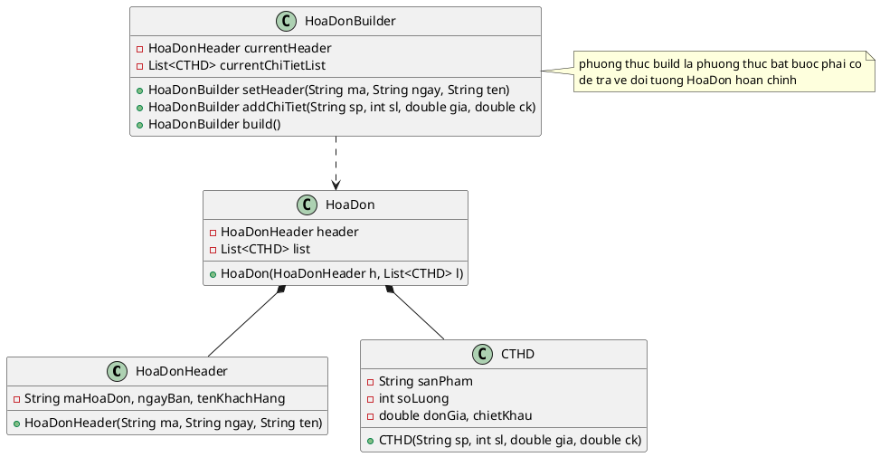

---

Chào bạn, tôi đã xem ảnh đề bài **A1 (Builder Pattern)**. Đây là một bài toán kinh điển để minh họa mẫu Builder: tạo ra một đối tượng phức tạp (`HoaDon`) được cấu thành từ các thành phần nhỏ hơn (`HoaDonHeader` và danh sách `CTHD`).

Dưới đây là lời giải chi tiết bao gồm **Code Java** và **Sơ đồ lớp PlantUML** để bạn đưa vào bài giảng.

### 1. Phân tích thiết kế (Dành cho sinh viên)

Bạn có thể giải thích cho sinh viên vì sao chọn Builder ở đây thay vì Constructor thường:

* **Vấn đề:** Một Hóa đơn có 1 Header nhưng có thể có **n** Chi tiết (CTHD). Nếu dùng Constructor thường, ta sẽ phải tạo `ArrayList` bên ngoài rồi truyền vào, rất lằng nhằng.
* **Giải pháp Builder:** Ta có thể viết code theo kiểu "kể chuyện": *Tạo hóa đơn -> Thêm thông tin chung -> Thêm dòng chi tiết 1 -> Thêm dòng chi tiết 2 -> ... -> Xây dựng xong.*

---

### 2. Source Code Java

```java
import java.util.ArrayList;
import java.util.List;

// 1. Lớp thành phần: Header của hóa đơn
class HoaDonHeader {
    String maHoaDon;
    String ngayBan;
    String tenKhachHang;

    public HoaDonHeader(String maHoaDon, String ngayBan, String tenKhachHang) {
        this.maHoaDon = maHoaDon;
        this.ngayBan = ngayBan;
        this.tenKhachHang = tenKhachHang;
    }

    @Override
    public String toString() {
        return "Mã: " + maHoaDon + " | Ngày: " + ngayBan + " | Khách: " + tenKhachHang;
    }
}

// 2. Lớp thành phần: Chi tiết hóa đơn (CTHD)
class CTHD {
    String sanPham;
    int soLuong;
    double donGia;
    double chietKhau;

    public CTHD(String sanPham, int soLuong, double donGia, double chietKhau) {
        this.sanPham = sanPham;
        this.soLuong = soLuong;
        this.donGia = donGia;
        this.chietKhau = chietKhau;
    }

    @Override
    public String toString() {
        return String.format("%-20s | SL: %2d | Giá: %,10.0f | CK: %.0f%%", sanPham, soLuong, donGia, chietKhau);
    }
}

// 3. Lớp Đối tượng phức tạp: Hóa Đơn (Sản phẩm cuối cùng)
class HoaDon {
    HoaDonHeader header;
    List<CTHD> chiTietList;

    // Constructor được gọi bởi Builder
    public HoaDon(HoaDonHeader header, List<CTHD> chiTietList) {
        this.header = header;
        this.chiTietList = chiTietList;
    }

    @Override
    public String toString() {
        StringBuilder sb = new StringBuilder();
        sb.append("=== HÓA ĐƠN BÁN LẺ ===\n");
        sb.append(header.toString()).append("\n");
        sb.append("--------------------------------------------------\n");
        for (CTHD cthd : chiTietList) {
            sb.append(cthd.toString()).append("\n");
        }
        sb.append("==================================================");
        return sb.toString();
    }
}

// 4. Lớp Builder: Chuyên nhiệm vụ xây dựng Hóa Đơn
class HoaDonBuilder {
    private HoaDonHeader currentHeader;
    private List<CTHD> currentChiTietList;

    public HoaDonBuilder() {
        this.currentChiTietList = new ArrayList<>();
    }

    // Bước 1: Xây dựng Header
    public HoaDonBuilder setHeader(String maHD, String ngayBan, String tenKH) {
        this.currentHeader = new HoaDonHeader(maHD, ngayBan, tenKH);
        return this; // Trả về chính nó để nối chuỗi (Fluent Interface)
    }

    // Bước 2: Thêm từng dòng chi tiết (có thể gọi nhiều lần)
    public HoaDonBuilder addChiTiet(String sanPham, int soLuong, double donGia, double chietKhau) {
        this.currentChiTietList.add(new CTHD(sanPham, soLuong, donGia, chietKhau));
        return this;
    }

    // Bước 3: Đóng gói trả về sản phẩm
    public HoaDon build() {
        return new HoaDon(currentHeader, currentChiTietList);
    }
}

// 5. Main Demo
public class Main {
    public static void main(String[] args) {
        // Sử dụng Builder để tạo hóa đơn
        HoaDon hoaDon = new HoaDonBuilder()
                .setHeader("HD001", "29/01/2026", "Nguyễn Văn A")
                .addChiTiet("Laptop Dell", 1, 15000000, 0.5)
                .addChiTiet("Chuột Logitech", 2, 500000, 0)
                .addChiTiet("Bàn phím cơ", 1, 2000000, 10)
                .build();

        System.out.println(hoaDon);
    }
}

```

---

### 3. Sơ đồ lớp PlantUML (.puml)

Bạn copy đoạn code sau vào file `.puml` trong IntelliJ IDEA.

Sơ đồ này thể hiện rõ quan hệ **Composition** (Mũi tên hình thoi đen `*--`): Hóa đơn được cấu tạo chặt chẽ bởi Header và CTHD.



### 💡 Gợi ý thêm cho bài giảng:

Khi chạy demo đoạn code `main`, bạn hãy chỉ cho sinh viên thấy sự "mượt mà" của code:

```java
new HoaDonBuilder()
    .setHeader(...)
    .addChiTiet(...)
    .addChiTiet(...) // Có thể thêm bao nhiêu tùy thích
    .build();

```

Đây chính là sức mạnh của Builder: giúp việc khởi tạo một đối tượng phức tạp trở nên dễ đọc và dễ mở rộng hơn rất nhiều so với việc nhồi nhét tất cả vào một constructor khổng lồ.