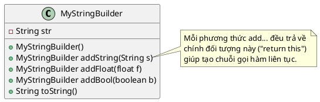

Chào bạn, đây là lời giải cho bài toán **A2 (Builder Pattern) - MyStringBuilder**.

Bài toán này yêu cầu chúng ta tự cài đặt lại cơ chế hoạt động của lớp `StringBuilder` trong Java. Đây là ví dụ điển hình của việc ứng dụng **Fluent Interface** (Giao diện trôi chảy) trong Builder Pattern: các phương thức trả về chính đối tượng đó (`return this`) để cho phép gọi chuỗi hàm liên tiếp.

### 1. Source Code Java

Theo yêu cầu đề bài, chúng ta sẽ không dùng `java.lang.StringBuilder` có sẵn mà tự xây dựng logic nối chuỗi thủ công.

```java
// 1. Lớp MyStringBuilder (Đóng vai trò là Builder và Product)
class MyStringBuilder {
    // Thuộc tính lưu trữ chuỗi đang xây dựng
    private String str;

    // Constructor khởi tạo chuỗi rỗng
    public MyStringBuilder() {
        this.str = ""; 
    }

    // Thêm chuỗi và trả về chính đối tượng này (return this)
    public MyStringBuilder addString(String s) {
        this.str += s; // Nối chuỗi
        return this;   // Trả về tham chiếu hiện tại để nối tiếp (Chaining)
    }

    // Thêm số thực
    public MyStringBuilder addFloat(float f) {
        this.str += f;
        return this;
    }

    // Thêm boolean
    public MyStringBuilder addBool(boolean b) {
        this.str += b;
        return this;
    }

    // Trả về kết quả cuối cùng
    @Override
    public String toString() {
        return this.str;
    }
}

// 2. Main Demo
public class Main {
    public static void main(String[] args) {
        // Sử dụng MyStringBuilder với phong cách nối chuỗi (Method Chaining)
        MyStringBuilder b = new MyStringBuilder()
                .addString("Xin chào, ")
                .addString("tôi năm nay ")
                .addFloat(20.5f)
                .addString(" tuổi. ")
                .addString("Độc thân: ")
                .addBool(true);

        // In kết quả
        System.out.println(b.toString());
    }
}

```

---

### 2. Sơ đồ lớp PlantUML (Compact Style)

Sơ đồ này thể hiện rõ các phương thức `add...` đều trả về kiểu `MyStringBuilder`, đây là dấu hiệu nhận biết của mẫu thiết kế này.



### 💡 Điểm nhấn sư phạm:

Khi giảng bài này, bạn hãy nhấn mạnh dòng `return this;`.

* Nếu không có `return this`, chúng ta sẽ phải gọi từng dòng:
```java
b.addString("A");
b.addString("B");

```


* Nhờ có `return this` (trả về chính cái builder đang cầm), ta viết được:
```java
b.addString("A").addString("B");

```


Đây chính là bản chất của **Builder Pattern** trong thực tế lập trình Java.