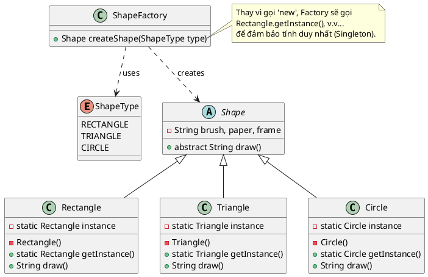

Chào bạn, đây là lời giải cho bài toán **A3 (Factory Method kết hợp Singleton)**.

Đây là một bài toán thú vị vì nó kết hợp 2 mẫu thiết kế:

1. **Factory Method:** Dùng `ShapeFactory` để che giấu logic khởi tạo, giúp Client không cần quan tâm đến các lớp cụ thể (`Rectangle`, `Circle`...).
2. **Singleton:** Yêu cầu đặc biệt của đề bài là các hình (`Rectangle`, `Triangle`, `Circle`) phải là **duy nhất** toàn cục. Do đó, Factory sẽ không tạo mới (`new`) liên tục mà sẽ trả về instance duy nhất của các hình đó.

### 1. Source Code Java

```java
// 1. Enum định nghĩa các loại hình
enum ShapeType {
    RECTANGLE, TRIANGLE, CIRCLE
}

// 2. Abstract Class: Shape (Lớp cha)
abstract class Shape {
    private String brush;
    private String paper;
    private String frame;

    // Constructor chung để khởi tạo thuộc tính
    public Shape(String brush, String paper, String frame) {
        this.brush = brush;
        this.paper = paper;
        this.frame = frame;
    }

    public abstract String draw();

    @Override
    public String toString() {
        return "Cấu hình: " + brush + ", " + paper + ", " + frame;
    }
}

// 3. Concrete Classes (Triển khai Singleton cho từng hình)

// --- Hình Chữ Nhật ---
class Rectangle extends Shape {
    private static Rectangle instance;

    private Rectangle() {
        super("Cọ vuông", "Giấy kẻ ô", "Khung gỗ");
    }

    public static synchronized Rectangle getInstance() {
        if (instance == null) instance = new Rectangle();
        return instance;
    }

    @Override
    public String draw() {
        return "Đang vẽ hình CHỮ NHẬT " + super.toString();
    }
}

// --- Hình Tam Giác ---
class Triangle extends Shape {
    private static Triangle instance;

    private Triangle() {
        super("Cọ nhọn", "Giấy than", "Khung sắt");
    }

    public static synchronized Triangle getInstance() {
        if (instance == null) instance = new Triangle();
        return instance;
    }

    @Override
    public String draw() {
        return "Đang vẽ hình TAM GIÁC " + super.toString();
    }
}

// --- Hình Tròn ---
class Circle extends Shape {
    private static Circle instance;

    private Circle() {
        super("Com-pa", "Giấy trắng", "Khung nhựa");
    }

    public static synchronized Circle getInstance() {
        if (instance == null) instance = new Circle();
        return instance;
    }

    @Override
    public String draw() {
        return "Đang vẽ hình TRÒN " + super.toString();
    }
}

// 4. Factory Class: ShapeFactory
class ShapeFactory {
    public Shape createShape(ShapeType shapeType) {
        switch (shapeType) {
            case RECTANGLE:
                return Rectangle.getInstance(); // Gọi Singleton thay vì new
            case TRIANGLE:
                return Triangle.getInstance();
            case CIRCLE:
                return Circle.getInstance();
            default:
                return null;
        }
    }
}

// 5. Main Demo
public class Main {
    public static void main(String[] args) {
        ShapeFactory factory = new ShapeFactory();

        // Yêu cầu tạo hình chữ nhật lần 1
        Shape s1 = factory.createShape(ShapeType.RECTANGLE);
        System.out.println(s1.draw());

        // Yêu cầu tạo hình chữ nhật lần 2
        Shape s2 = factory.createShape(ShapeType.RECTANGLE);
        
        // Kiểm tra xem có phải là cùng một đối tượng không (Singleton)
        System.out.println("\n--- Kiểm tra Singleton ---");
        System.out.println("S1 HashCode: " + s1.hashCode());
        System.out.println("S2 HashCode: " + s2.hashCode());
        
        if (s1 == s2) {
            System.out.println("=> Kết luận: Cả hai là cùng một đối tượng duy nhất!");
        }
    }
}

```

---

### 2. Sơ đồ lớp PlantUML (Compact Style)

Đoạn mã này tuân thủ phong cách tối giản, thể hiện sự kết hợp giữa Factory (mũi tên tạo đối tượng) và Singleton (biến instance tĩnh bên trong các lớp con).



### 💡 Gợi ý giảng dạy:

Bạn hãy chỉ cho sinh viên thấy sự khác biệt quan trọng trong hàm `createShape` của Factory:

* **Factory thường:** `return new Rectangle();` (Mỗi lần gọi ra một hình mới).
* **Factory + Singleton (Bài này):** `return Rectangle.getInstance();` (Gọi 100 lần vẫn trả về đúng 1 hình đó). Code demo trong hàm `main` (so sánh hashcode) sẽ chứng minh điều này.