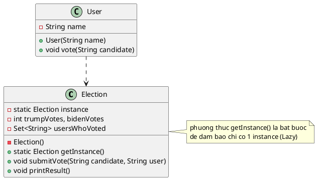

Chào bạn, đây là một bài tập rất hay và thực tế để sinh viên hiểu về **Singleton Pattern** kết hợp với quản lý trạng thái (State Management).

Dựa trên yêu cầu trong hình ảnh (Khởi tạo Lazy, Đa người dùng, Mỗi người bầu 1 lần), tôi đã soạn thảo đoạn code Java hoàn chỉnh bên dưới. Bạn có thể dùng code này để demo trực tiếp trên lớp.

### Phân tích giải pháp (Cho sinh viên):

1. **Singleton (Lazy):** Class `Election` sẽ không được tạo ngay khi chương trình chạy, mà chỉ được tạo khi người đầu tiên gọi `getInstance()`.
2. **Quản lý phiếu bầu (Logic "At most once"):** Chúng ta sử dụng một `Set<String>` để lưu tên những người đã bầu. `Set` trong Java có tính chất không chứa phần tử trùng lặp, rất hợp để kiểm tra ai đã bầu rồi.
3. **Thread-safety:** Vì đề bài nhắc đến "nhiều người dùng truy cập", tôi thêm từ khóa `synchronized` vào phương thức `getInstance` để đảm bảo an toàn (dù đề bài không bắt buộc, nhưng là điểm cộng lớn).

### 💻 Source Code Java

```java
import java.util.HashSet;
import java.util.Set;

// 1. Lớp Singleton: Election (Hệ thống bầu cử)
class Election {
    // Biến static giữ thể hiện duy nhất
    private static Election instance;
    
    // Các biến để lưu trữ trạng thái bầu cử
    private int trumpVotes = 0;
    private int bidenVotes = 0;
    
    // Set để lưu danh sách những người đã bỏ phiếu (đảm bảo mỗi người chỉ bầu 1 lần)
    private Set<String> usersWhoVoted;

    // Constructor Private: Ngăn không cho bên ngoài dùng 'new'
    private Election() {
        usersWhoVoted = new HashSet<>();
        System.out.println("--> Hệ thống Election đã được khởi tạo (Lazy Initialization)!");
    }

    // Phương thức Static: Cung cấp điểm truy cập toàn cục
    // Có synchronized để an toàn khi nhiều User cùng truy cập
    public static synchronized Election getInstance() {
        if (instance == null) {
            instance = new Election(); // Chỉ khởi tạo khi chưa có (Lazy)
        }
        return instance;
    }

    // Phương thức xử lý logic bầu chọn
    public void submitVote(String candidate, String userName) {
        // Kiểm tra xem người này đã bầu chưa
        if (usersWhoVoted.contains(userName)) {
            System.out.println("❌ CẢNH BÁO: " + userName + " đã bầu rồi! Không được bầu lại.");
            return;
        }

        // Ghi nhận phiếu bầu
        if (candidate.equalsIgnoreCase("Donald Trump")) {
            trumpVotes++;
        } else if (candidate.equalsIgnoreCase("Joe Biden")) {
            bidenVotes++;
        } else {
            System.out.println("⚠️ Ứng viên không hợp lệ.");
            return;
        }

        // Đánh dấu người dùng đã bầu
        usersWhoVoted.add(userName);
        System.out.println("✅ " + userName + " đã bầu cho " + candidate + " thành công.");
    }

    // Phương thức hiển thị kết quả
    public void printResult() {
        System.out.println("\n--- KẾT QUẢ BẦU CỬ ---");
        System.out.println("Donald Trump: " + trumpVotes + " phiếu");
        System.out.println("Joe Biden:    " + bidenVotes + " phiếu");
        System.out.println("----------------------\n");
    }
}

// 2. Lớp Người dùng (User)
class User {
    private String name;

    public User(String name) {
        this.name = name;
    }

    public void vote(String candidate) {
        // Gọi đến Singleton instance để thực hiện bầu cử
        Election system = Election.getInstance();
        system.submitVote(candidate, this.name);
    }
}

// 3. Class Main để chạy thử kịch bản
public class ElectionDemo {
    public static void main(String[] args) {
        System.out.println("Bắt đầu chương trình...");

        // Tạo các cử tri
        User user1 = new User("Sinh Viên A");
        User user2 = new User("Giảng Viên B");
        User user3 = new User("Sinh Viên C");

        // Kịch bản bầu cử
        // Lần đầu tiên gọi vote, Election mới được khởi tạo (Lazy)
        user1.vote("Donald Trump"); 
        
        user2.vote("Joe Biden");
        
        // Sinh viên A cố tình bầu lại -> Sẽ bị chặn
        user1.vote("Joe Biden"); 

        user3.vote("Donald Trump");

        // In kết quả cuối cùng
        Election.getInstance().printResult();
    }
}

```

### 📝 Gợi ý vẽ sơ đồ lớp (Class Diagram) cho sinh viên

Vì hình ảnh yêu cầu "Vẽ sơ đồ lớp", bạn có thể hướng dẫn sinh viên vẽ như sau:

1. **Class `Election**`:
* Có biến `private static Election instance`.
* Có biến `private int trumpVotes`, `private int bidenVotes`.
* Có biến `private Set<String> usersWhoVoted`.
* Phương thức `public static Election getInstance()`.
* Phương thức `public void vote(String candidate, String user)`.
* *Quan trọng:* Constructor phải đánh dấu là `- Election()` (private).


2. **Class `User**`:
* Có thuộc tính `name`.
* Có phương thức `vote(String candidate)`.


3. **Mối quan hệ**:
* `User` có mối quan hệ **phụ thuộc (dependency)** hoặc **sử dụng (association)** với `Election`. Mũi tên từ `User` trỏ sang `Election`.
* `Election` có một mũi tên tự trỏ vào chính nó (thể hiện biến `instance` tĩnh).


Hy vọng đoạn code này giúp bạn tiết kiệm thời gian chuẩn bị bài giảng! Bạn có cần thêm phần giải thích nào không?

---

Tất nhiên rồi. Đây là mã nguồn PlantUML (.puml) được thiết kế chuẩn cho IntelliJ IDEA để vẽ sơ đồ lớp cho bài toán **Election Singleton** của bạn.

Mã này sử dụng các ký hiệu chuẩn UML: gạch chân cho `static`, dấu trừ `-` cho `private`, và mũi tên phụ thuộc.

### Mã PlantUML (Copy và paste vào file .puml trong IntelliJ)



### 💡 Một số điểm lưu ý khi giảng qua sơ đồ này:

1. **Dấu gạch chân (Underline):** Trong UML, thuộc tính hoặc phương thức được gạch chân (như `instance` và `getInstance`) biểu thị cho từ khóa **`static`**.
2. **Dấu trừ (-):** Biểu thị **`private`**. Sinh viên cần thấy rõ constructor `Election()` là private.
3. **Mũi tên nét đứt (`..>`):** Biểu thị mối quan hệ **Dependency (Phụ thuộc)**. `User` không sở hữu `Election` (như Composition), mà chỉ **sử dụng** `Election` trong một khoảng thời gian ngắn khi gọi hàm `vote()`.

Bạn có muốn thêm chi tiết nào vào sơ đồ (ví dụ: hiển thị rõ biến `Set` hoặc thêm hàm main) không?