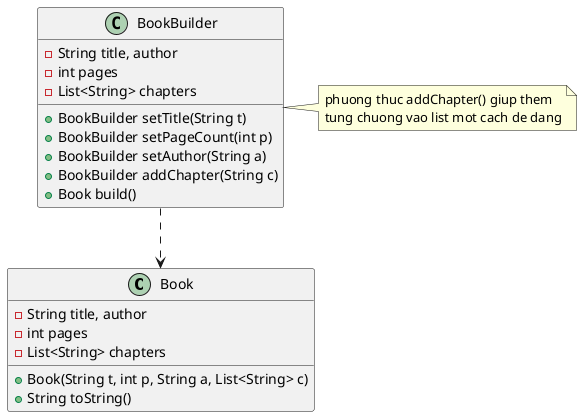

Chào bạn, đây là lời giải cho bài toán **A5 (Builder Pattern) - Xây dựng cuốn sách**.

Bài toán này có một điểm thú vị hơn bài Hóa đơn trước đó: phần **Danh sách các chương**. Với Builder Pattern, thay vì bắt người dùng phải tạo một `List` bên ngoài rồi truyền vào, chúng ta cung cấp phương thức `addChapter()` để thêm từng chương một cách tự nhiên.

Dưới đây là Code Java và Sơ đồ lớp (PUML) theo phong cách tối giản mà bạn đã chọn.

### 1. Source Code Java

```java
import java.util.ArrayList;
import java.util.List;

// 1. Lớp Sản phẩm: Cuốn Sách (Book)
class Book {
    private String title;
    private int pages;
    private String author;
    private List<String> chapters;

    public Book(String title, int pages, String author, List<String> chapters) {
        this.title = title;
        this.pages = pages;
        this.author = author;
        this.chapters = chapters;
    }

    @Override
    public String toString() {
        StringBuilder sb = new StringBuilder();
        sb.append("=== THÔNG TIN SÁCH ===\n");
        sb.append("Tựa đề: ").append(title).append("\n");
        sb.append("Tác giả: ").append(author).append("\n");
        sb.append("Số trang: ").append(pages).append("\n");
        sb.append("--- Mục lục ---\n");
        for (int i = 0; i < chapters.size(); i++) {
            sb.append((i + 1) + ". " + chapters.get(i)).append("\n");
        }
        sb.append("======================\n");
        return sb.toString();
    }
}

// 2. Lớp Builder: Chuyên xây dựng Book
class BookBuilder {
    private String title;
    private int pages;
    private String author;
    private List<String> chapters;

    public BookBuilder() {
        this.chapters = new ArrayList<>(); // Khởi tạo list rỗng ngay từ đầu
    }

    public BookBuilder setTitle(String title) {
        this.title = title;
        return this;
    }

    public BookBuilder setPageCount(int pages) {
        this.pages = pages;
        return this;
    }

    public BookBuilder setAuthor(String author) {
        this.author = author;
        return this;
    }

    // Điểm hay của Builder: Thêm từng chương một thay vì truyền cả list
    public BookBuilder addChapter(String chapterTitle) {
        this.chapters.add(chapterTitle);
        return this;
    }

    // Phương thức chốt để trả về đối tượng Book
    public Book build() {
        return new Book(title, pages, author, chapters);
    }
}

// 3. Main Demo
public class Main {
    public static void main(String[] args) {
        Book myBook = new BookBuilder()
                .setTitle("Design Patterns cho người mới bắt đầu")
                .setAuthor("Nguyễn Văn A")
                .setPageCount(350)
                .addChapter("Chương 1: Singleton - Kẻ độc nhất")
                .addChapter("Chương 2: Builder - Người xây dựng")
                .addChapter("Chương 3: Factory - Nhà máy vạn năng")
                .build();

        System.out.println(myBook);
    }
}

```

---

### 2. Sơ đồ lớp PlantUML (Compact Style)

Đây là mã PUML được viết theo phong cách gọn gàng, gom nhóm thuộc tính mà bạn yêu thích.



### 💡 Điểm nhấn sư phạm:

Trong ví dụ này, hãy nhấn mạnh với sinh viên về phương thức **`addChapter()`** trong Builder.

* **Cách cũ:** Sinh viên phải tạo `ArrayList`, `add` 3 lần bên ngoài, rồi mới truyền vào Constructor `Book`.
* **Cách Builder:** Chỉ cần gọi `.addChapter(...)` liên tiếp. Đây là ví dụ rõ nhất cho việc Builder giúp code phía Client "sạch" và dễ đọc hơn.