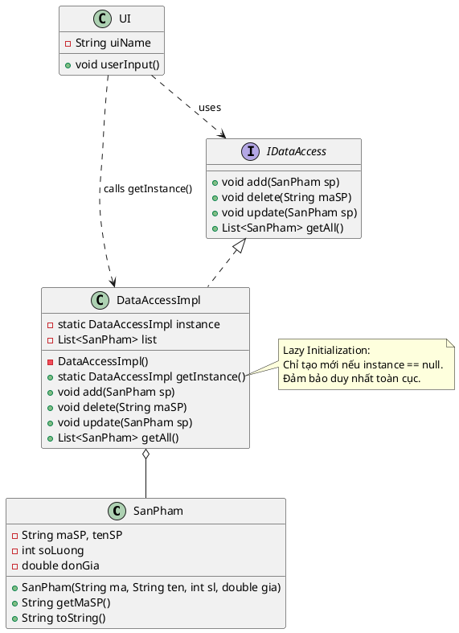

Chào bạn, đây là lời giải cho bài toán **A6**. Bài toán này yêu cầu kết hợp hai yếu tố:

1. **Singleton:** Để đảm bảo `dataAccess` là duy nhất và tiết kiệm tài nguyên (Lazy).
2. **Design for Extension (Thiết kế để mở rộng):** Để giải quyết trường hợp có nhiều loại `dataAccess` khác nhau, chúng ta cần áp dụng nguyên lý **Dependency Inversion** thông qua một **Interface**.

Dưới đây là giải pháp chi tiết.

### 1. Phân tích giải pháp (Dành cho sinh viên)

* **Tại sao cần Interface `IDataAccess`?**
Đề bài yêu cầu "thiết kế mở rộng" khi có 2 hay nhiều loại dataAccess. Nếu ta code cứng `ui1` gọi trực tiếp class `DataAccess`, sau này muốn đổi sang loại lưu trữ khác sẽ phải sửa code ở UI. Dùng Interface giúp các UI không phụ thuộc vào class cụ thể.
* **Singleton ở đâu?**
Nằm trong class `DataAccessImpl`. Nó đảm bảo dù `ui1`, `ui2`, `ui3` gọi bao nhiêu lần thì vẫn chỉ làm việc trên **một danh sách sản phẩm duy nhất** trong RAM.

---

### 2. Source Code Java

```java
import java.util.ArrayList;
import java.util.List;

// 1. Entity: Sản Phẩm
class SanPham {
    private String maSP;
    private String tenSP;
    private int soLuong;
    private double donGia;

    public SanPham(String maSP, String tenSP, int soLuong, double donGia) {
        this.maSP = maSP;
        this.tenSP = tenSP;
        this.soLuong = soLuong;
        this.donGia = donGia;
    }

    public String getMaSP() { return maSP; }

    @Override
    public String toString() {
        return String.format("SP[%s - %s - SL:%d - Giá:%.0f]", maSP, tenSP, soLuong, donGia);
    }
    
    // Setter để update
    public void setSoLuong(int soLuong) { this.soLuong = soLuong; }
    public void setDonGia(double donGia) { this.donGia = donGia; }
}

// 2. Interface: IDataAccess (Giải quyết yêu cầu mở rộng)
// Các UI sẽ làm việc với Interface này chứ không làm việc trực tiếp với class con
interface IDataAccess {
    void add(SanPham sp);
    void delete(String maSP);
    void update(SanPham sp);
    List<SanPham> getAll();
}

// 3. Concrete Singleton: DataAccessImpl (Giải quyết yêu cầu Duy nhất & Lazy)
class DataAccessImpl implements IDataAccess {
    // Biến static giữ instance duy nhất
    private static DataAccessImpl instance;
    
    // Giả lập CSDL trong RAM
    private List<SanPham> listSanPham;

    // Constructor Private (Chặn new)
    private DataAccessImpl() {
        listSanPham = new ArrayList<>();
        System.out.println("--> Khởi tạo DataAccess (Kết nối CSDL...)");
    }

    // Lazy Initialization
    public static synchronized DataAccessImpl getInstance() {
        if (instance == null) {
            instance = new DataAccessImpl();
        }
        return instance;
    }

    // --- Các phương thức nghiệp vụ từ Interface ---
    @Override
    public void add(SanPham sp) {
        listSanPham.add(sp);
        System.out.println("Đã thêm: " + sp.getMaSP());
    }

    @Override
    public void delete(String maSP) {
        listSanPham.removeIf(sp -> sp.getMaSP().equals(maSP));
        System.out.println("Đã xóa: " + maSP);
    }

    @Override
    public void update(SanPham spMoi) {
        for (SanPham sp : listSanPham) {
            if (sp.getMaSP().equals(spMoi.getMaSP())) {
                sp.setSoLuong(300); // Demo update
                System.out.println("Đã cập nhật: " + spMoi.getMaSP());
                return;
            }
        }
    }

    @Override
    public List<SanPham> getAll() {
        return listSanPham;
    }
}

// 4. Client: Giả lập các màn hình UI
class UI {
    private String uiName;

    public UI(String uiName) {
        this.uiName = uiName;
    }

    public void userInput() {
        // UI lấy DataAccess thông qua Singleton
        IDataAccess db = DataAccessImpl.getInstance();
        
        System.out.println(uiName + " đang thao tác...");
        db.add(new SanPham(uiName + "_ID", "Laptop", 10, 2000));
    }
}

// 5. Main Demo
public class Main {
    public static void main(String[] args) {
        // Giả lập 3 UI cùng chạy
        UI ui1 = new UI("UI_1");
        UI ui2 = new UI("UI_2");
        UI ui3 = new UI("UI_3");

        // UI1 thêm dữ liệu -> DataAccess được khởi tạo lần đầu
        ui1.userInput();
        
        // UI2 thêm dữ liệu -> Dùng lại DataAccess cũ
        ui2.userInput();

        // Kiểm tra kết quả: DataAccess phải chứa dữ liệu của cả 2
        System.out.println("\n--- Tổng kết Danh sách trong DB ---");
        IDataAccess db = DataAccessImpl.getInstance();
        for (SanPham sp : db.getAll()) {
            System.out.println(sp);
        }
    }
}

```

---

### 3. Sơ đồ lớp PlantUML (Compact Style)

Đoạn code này sử dụng phong cách tối giản mà bạn đã chọn: gom nhóm thuộc tính và sử dụng quan hệ `implements` (đường nét đứt tam giác rỗng) và `dependency` (mũi tên nét đứt).



### 💡 Gợi ý giảng dạy:

Bạn hãy chỉ cho sinh viên thấy mũi tên từ `UI` -> `IDataAccess`.

* Điều này thể hiện **Design for Extension**: Nếu sau này có thêm `DataAccessSQL` hay `DataAccessCloud`, ta chỉ cần tạo class mới implement `IDataAccess`. Code trong `UI` (nơi gọi các hàm `add/delete`) sẽ không bị ảnh hưởng nhiều.