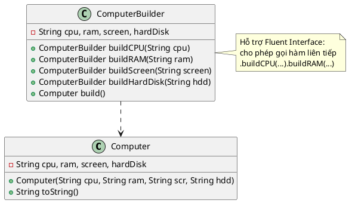

Chào bạn, đây là lời giải cho bài toán **A7 (Builder Pattern) - Cấu hình Máy tính**.

Đây là ví dụ kinh điển nhất của Builder Pattern mà mình đã nhắc đến ở đầu buổi: Xây dựng một đối tượng phức tạp (Máy tính) với nhiều tùy chọn cấu hình khác nhau mà không cần viết quá nhiều Constructor.

### 1. Source Code Java

```java
// 1. Lớp Sản phẩm: Computer (Máy tính)
class Computer {
    private String cpu;
    private String ram;
    private String screen;
    private String hardDisk;

    // Constructor private: Chỉ cho phép Builder gọi
    public Computer(String cpu, String ram, String screen, String hardDisk) {
        this.cpu = cpu;
        this.ram = ram;
        this.screen = screen;
        this.hardDisk = hardDisk;
    }

    @Override
    public String toString() {
        return "Computer Config: [CPU=" + cpu + ", RAM=" + ram + 
               ", Screen=" + screen + ", HDD=" + hardDisk + "]";
    }
}

// 2. Lớp Builder: Chuyên xây dựng cấu hình Máy tính
class ComputerBuilder {
    private String cpu;
    private String ram;
    private String screen;
    private String hardDisk;

    // Các phương thức xây dựng từng thành phần (Fluent Interface)
    public ComputerBuilder buildCPU(String cpu) {
        this.cpu = cpu;
        return this; // Trả về chính nó để nối chuỗi
    }

    public ComputerBuilder buildRAM(String ram) {
        this.ram = ram;
        return this;
    }

    public ComputerBuilder buildScreen(String screen) {
        this.screen = screen;
        return this;
    }

    public ComputerBuilder buildHardDisk(String hardDisk) {
        this.hardDisk = hardDisk;
        return this;
    }

    // Phương thức chốt để trả về đối tượng Computer hoàn chỉnh
    public Computer build() {
        return new Computer(cpu, ram, screen, hardDisk);
    }
}

// 3. Main Demo
public class Main {
    public static void main(String[] args) {
        // Cấu hình máy tính Gaming
        Computer gamingPC = new ComputerBuilder()
                .buildCPU("Intel Core i9 14900K")
                .buildRAM("64GB DDR5")
                .buildHardDisk("2TB NVMe SSD")
                .buildScreen("27 inch 4K 144Hz")
                .build();

        // Cấu hình máy tính Văn phòng (Có thể bỏ qua Screen nếu không cần mua màn hình)
        Computer officePC = new ComputerBuilder()
                .buildCPU("Intel Core i5")
                .buildRAM("16GB")
                .buildHardDisk("512GB SSD")
                .build(); // Không gọi buildScreen -> giá trị sẽ là null

        System.out.println("1. Gaming PC: " + gamingPC);
        System.out.println("2. Office PC: " + officePC);
    }
}

```

---

### 2. Sơ đồ lớp PlantUML (Compact Style)

Đây là sơ đồ lớp theo phong cách tối giản mà bạn đã chọn, thể hiện đúng các trường dữ liệu và phương thức `build...` đặc trưng.



### 💡 Gợi ý giảng dạy:

Với bài này, bạn có thể đặt câu hỏi cho sinh viên: *"Nếu dùng Constructor thông thường, làm sao để tạo một cái máy tính **chỉ có CPU và RAM** (không có màn hình, ổ cứng)?"*

* **Cách thường:** Phải viết thêm Constructor 2 tham số, hoặc truyền `null` vào các tham số còn lại (rất xấu và dễ nhầm).
* **Cách Builder:** Chỉ cần gọi `.buildCPU(...).buildRAM(...).build()` là xong. Rất linh hoạt!