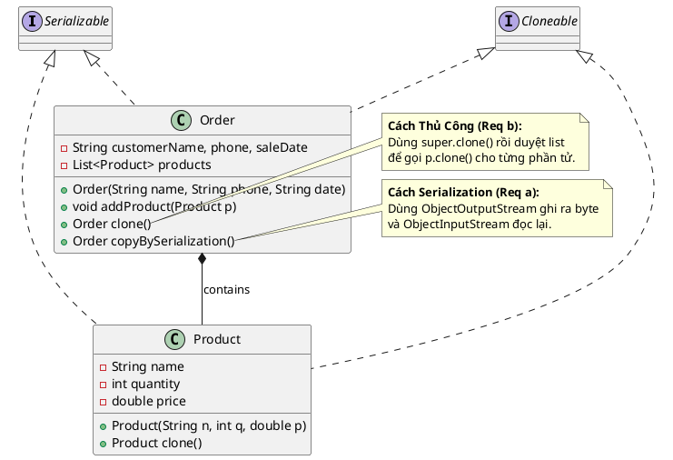

Chào bạn, đây là lời giải cho bài toán **A8 (Prototype Pattern)**.

Bài toán này tập trung vào kỹ thuật **Deep Copy** (Sao chép sâu). Trong Java, khi một đối tượng chứa danh sách các đối tượng khác (như `Order` chứa `List<Product>`), nếu chỉ dùng `clone()` mặc định thì nó chỉ sao chép tham chiếu (Shallow Copy).

* **Yêu cầu a (Serialization):** Đây là "mẹo" để sao chép sâu toàn bộ đối tượng bằng cách biến nó thành dòng byte rồi đọc lại. Cách này chậm nhưng code rất ngắn và sạch.
* **Yêu cầu b (Manual Clone):** Đây là cách chính thống, chúng ta phải đi vào từng phần tử con và clone nó thủ công.

### 1. Source Code Java

```java
import java.io.*;
import java.util.ArrayList;
import java.util.List;

// 1. Lớp Sản Phẩm (Product)
// Phải implements Serializable (cho Cách A) và Cloneable (cho Cách B)
class Product implements Serializable, Cloneable {
    private String name;
    private int quantity;
    private double price;

    public Product(String name, int quantity, double price) {
        this.name = name;
        this.quantity = quantity;
        this.price = price;
    }

    @Override
    public String toString() {
        return name + " (x" + quantity + ")";
    }

    // Phương thức clone() cơ bản (cho Cách B)
    @Override
    public Product clone() {
        try {
            return (Product) super.clone();
        } catch (CloneNotSupportedException e) {
            return null;
        }
    }
    
    // Setter để demo kiểm tra Deep Copy
    public void setName(String name) { this.name = name; }
}

// 2. Lớp Hóa Đơn (Order)
class Order implements Serializable, Cloneable {
    private String customerName;
    private String phone;
    private String saleDate;
    private List<Product> products;

    public Order(String customerName, String phone, String saleDate) {
        this.customerName = customerName;
        this.phone = phone;
        this.saleDate = saleDate;
        this.products = new ArrayList<>();
    }

    public void addProduct(Product p) {
        this.products.add(p);
    }

    @Override
    public String toString() {
        return "Order[" + customerName + "] Products: " + products;
    }

    // --- YÊU CẦU B: Deep Copy dùng phương thức clone() thủ công ---
    @Override
    public Order clone() {
        try {
            // 1. Sao chép nông các thuộc tính cơ bản (String, int...)
            Order newOrder = (Order) super.clone();
            
            // 2. Khởi tạo lại list mới để tránh dùng chung tham chiếu
            newOrder.products = new ArrayList<>();
            
            // 3. Clone từng sản phẩm con bên trong
            for (Product p : this.products) {
                newOrder.products.add(p.clone()); // Gọi clone() của lớp Product
            }
            
            return newOrder;
        } catch (CloneNotSupportedException e) {
            return null;
        }
    }

    // --- YÊU CẦU A: Deep Copy dùng Serialization ---
    public Order copyBySerialization() {
        try {
            // 1. Ghi đối tượng hiện tại ra luồng byte (ByteArrayOutputStream)
            ByteArrayOutputStream bos = new ByteArrayOutputStream();
            ObjectOutputStream oos = new ObjectOutputStream(bos);
            oos.writeObject(this);
            oos.flush();

            // 2. Đọc lại từ luồng byte đó để tạo đối tượng mới hoàn toàn độc lập
            ByteArrayInputStream bis = new ByteArrayInputStream(bos.toByteArray());
            ObjectInputStream ois = new ObjectInputStream(bis);
            
            return (Order) ois.readObject();
        } catch (IOException | ClassNotFoundException e) {
            e.printStackTrace();
            return null;
        }
    }
    
    // Getter để demo
    public List<Product> getProducts() { return products; }
}

// 3. Main Demo
public class Main {
    public static void main(String[] args) {
        // Tạo hóa đơn gốc
        Order original = new Order("Khách A", "090123456", "30/01/2026");
        original.addProduct(new Product("Laptop", 1, 1500));
        original.addProduct(new Product("Mouse", 2, 20));

        System.out.println("Gốc: " + original);

        // Cách 1: Clone thủ công (Requirement b)
        Order clone1 = original.clone();
        
        // Cách 2: Clone bằng Serialization (Requirement a)
        Order clone2 = original.copyBySerialization();

        // --- KIỂM TRA DEEP COPY ---
        // Sửa tên sản phẩm ở bản gốc
        original.getProducts().get(0).setName("Laptop CŨ (Đã sửa)");

        System.out.println("\n--- Sau khi sửa bản gốc ---");
        System.out.println("Gốc:    " + original);
        System.out.println("Clone1: " + clone1 + " (Không bị đổi -> OK)");
        System.out.println("Clone2: " + clone2 + " (Không bị đổi -> OK)");
    }
}

```

---

### 2. Sơ đồ lớp PlantUML (Compact Style)

Sơ đồ dưới đây thể hiện việc thực thi 2 interfaces quan trọng là `Serializable` và `Cloneable`, đồng thời ghi chú rõ hai phương pháp sao chép.



### 💡 Gợi ý giảng dạy:

* Bạn hãy chạy demo phần `main` để sinh viên thấy rõ: khi sửa dữ liệu ở bản gốc (`original`), các bản sao (`clone1`, `clone2`) **không bị thay đổi theo**.
* Đây là cách chứng minh trực quan nhất thế nào là **Deep Copy** (Sao chép sâu). Nếu làm sai (Shallow Copy), bản sao sẽ bị biến đổi theo bản gốc.