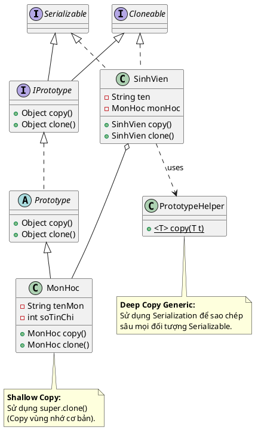

Chào bạn, đây là lời giải chi tiết cho bài toán **A9 (Prototype Pattern)**.

Bài toán này yêu cầu chúng ta so sánh hai cách cài đặt Prototype Pattern:

1. **Cách truyền thống:** Sử dụng Interface/Abstract class và phương thức `clone()` của Java (thường là Shallow Copy).
2. **Cách hiện đại (Helper):** Sử dụng một lớp tiện ích `PrototypeHelper` để thực hiện Deep Copy thông qua cơ chế Serialization (Tuần tự hóa).

---

### 1. Source Code Java

Tôi sẽ tách rõ hai cách tiếp cận để bạn dễ hình dung và so sánh.

```java
import java.io.*;

// ==========================================
// CÁCH 1: Dùng Interface & Clone (Shallow Copy)
// ==========================================

// 1.1. Interface IPrototype
interface IPrototype extends Cloneable, Serializable {
    Object copy();
    Object clone();
}

// 1.2. Lớp abstract Prototype (Triển khai cơ bản)
abstract class Prototype implements IPrototype {
    @Override
    public Object clone() {
        try {
            return super.clone(); // Sử dụng clone mặc định của Java (Shallow)
        } catch (CloneNotSupportedException e) {
            return null;
        }
    }

    @Override
    public Object copy() {
        return this.clone(); // Copy đơn giản là gọi clone
    }
}

// 1.3. Lớp Demo MonHoc (Thừa kế Prototype)
class MonHoc extends Prototype {
    private String tenMon;
    private int soTinChi;

    public MonHoc(String tenMon, int soTinChi) {
        this.tenMon = tenMon;
        this.soTinChi = soTinChi;
    }

    // Override để ép kiểu về đúng lớp con (Covariant Return Type)
    @Override
    public MonHoc copy() {
        return (MonHoc) super.copy();
    }

    @Override
    public MonHoc clone() {
        return (MonHoc) super.clone();
    }

    @Override
    public String toString() {
        return "MonHoc[Tên=" + tenMon + ", TC=" + soTinChi + ", Hash=" + System.identityHashCode(this) + "]";
    }
}

// ==========================================
// CÁCH 2: Dùng Helper & Serialization (Deep Copy)
// ==========================================

// 2.1. Class PrototypeHelper (Tiện ích Deep Copy)
class PrototypeHelper {
    // Phương thức copy tổng quát cho mọi đối tượng Serializable
    public static <T extends Serializable> T copy(T t) {
        try {
            // Ghi ra byte array
            ByteArrayOutputStream bos = new ByteArrayOutputStream();
            ObjectOutputStream oos = new ObjectOutputStream(bos);
            oos.writeObject(t);
            oos.flush();

            // Đọc lại từ byte array -> Tạo ra object mới hoàn toàn
            ByteArrayInputStream bis = new ByteArrayInputStream(bos.toByteArray());
            ObjectInputStream ois = new ObjectInputStream(bis);
            return (T) ois.readObject();
        } catch (Exception e) {
            e.printStackTrace();
            return null;
        }
    }
}

// 2.2. Lớp Demo SinhVien (Dùng Helper)
class SinhVien implements Cloneable, Serializable {
    private String ten;
    private MonHoc monHoc; // Tham chiếu đến object khác

    public SinhVien(String ten, MonHoc monHoc) {
        this.ten = ten;
        this.monHoc = monHoc;
    }

    // Copy dùng Helper (Deep Copy)
    public SinhVien copy() {
        return PrototypeHelper.copy(this);
    }

    // Clone dùng Java native (Shallow Copy)
    @Override
    public SinhVien clone() {
        try {
            return (SinhVien) super.clone();
        } catch (CloneNotSupportedException e) {
            return null;
        }
    }

    public MonHoc getMonHoc() { return monHoc; }
    
    @Override
    public String toString() {
        return "SV[" + ten + "] - " + monHoc;
    }
}

// ==========================================
// 3. MAIN DEMO
// ==========================================
public class Main {
    public static void main(String[] args) {
        System.out.println("--- CÁCH 1: Interface & Clone (Shallow) ---");
        MonHoc mh1 = new MonHoc("Lập trình Java", 3);
        MonHoc mh2 = mh1.copy(); // Copy từ mh1
        System.out.println("Gốc: " + mh1);
        System.out.println("Sao: " + mh2);

        System.out.println("\n--- CÁCH 2: Helper (Deep Copy) ---");
        SinhVien sv1 = new SinhVien("Nguyen Van A", mh1);
        
        // Tạo bản sao dùng Helper
        SinhVien sv2 = sv1.copy(); 

        System.out.println("Trước khi sửa: ");
        System.out.println("SV1: " + sv1);
        System.out.println("SV2: " + sv2);

        // Kiểm tra Deep Copy: Tạo ra MonHoc mới cho SV1 để xem SV2 có bị ảnh hưởng không?
        // (Lưu ý: Với Deep Copy, sv1 và sv2 độc lập hoàn toàn)
        System.out.println("-> SV1 và SV2 là hai đối tượng khác nhau: " + (sv1 != sv2));
        System.out.println("-> Môn học bên trong cũng khác nhau: " + (sv1.getMonHoc() != sv2.getMonHoc()));
    }
}

```

---

### 2. Sơ đồ lớp PlantUML (Compact Style)

Sơ đồ thể hiện rõ hai nhánh: một nhánh kế thừa từ `Prototype` (Cách 1) và một nhánh sử dụng `PrototypeHelper` (Cách 2).



---

### 3. So sánh Ưu & Nhược điểm (Dành cho sinh viên)

Đây là phần quan trọng để trả lời câu hỏi cuối cùng trong đề bài.

| Tiêu chí | Cách 1: Interface & `clone()` (Native) | Cách 2: `PrototypeHelper` (Serialization) |
| --- | --- | --- |
| **Cơ chế** | Sử dụng hàm `clone()` của hệ thống (copy bit-wise bộ nhớ). | Chuyển đối tượng thành byte (Serialize) rồi đọc lại (Deserialize). |
| **Loại Copy** | Mặc định là **Shallow Copy** (Sao chép nông). Nếu đối tượng chứa tham chiếu khác, bản sao vẫn trỏ về vùng nhớ cũ. | Luôn là **Deep Copy** (Sao chép sâu). Tạo ra đối tượng mới hoàn toàn độc lập, kể cả các đối tượng con bên trong. |
| **Hiệu năng** | **Rất nhanh** (vì thao tác trực tiếp trên RAM). | **Chậm hơn** (do chi phí I/O luồng và xử lý metadata của object). |
| **Độ phức tạp** | **Cao nếu muốn Deep Copy**: Phải tự viết code clone đệ quy cho từng thuộc tính con. | **Thấp**: Chỉ cần viết 1 hàm Helper duy nhất, dùng chung cho mọi class. |
| **Khi nào dùng?** | Khi đối tượng đơn giản (chỉ chứa int, double, String...) hoặc cần tốc độ cực cao. | Khi đối tượng phức tạp, nhiều lớp lồng nhau và cần sự độc lập hoàn toàn giữa bản gốc và bản sao. |