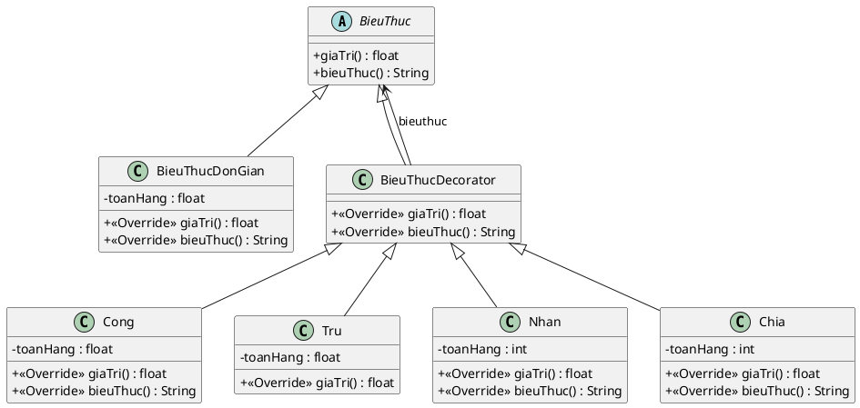

Dưới đây là đoạn mã PlantUML (PUML) được viết bám sát theo chính xác những gì thể hiện trong biểu đồ UML ở hình ảnh bạn cung cấp:

**Một vài điểm đáng chú ý từ biểu đồ gốc:**

* Thuộc tính `toanHang` của `Cong` và `Tru` là kiểu `float`, trong khi của `Nhan` và `Chia` lại được ghi là kiểu `int`.
* Lớp `Tru` trong hình vẽ thiếu mất phương thức `bieuThuc() : String` (có thể do lỗi đánh máy của người vẽ biểu đồ), tôi đã giữ nguyên đúng như hình ảnh bạn cung cấp.
* Mối quan hệ từ `BieuThucDecorator` đến `BieuThuc` là một mũi tên liên kết (Association) có nhãn `bieuthuc`.

Bạn có thể copy đoạn mã này và dán vào các trình render như PlantText hoặc các plugin trên IDE (VSCode, IntelliJ...) để tạo ra hình ảnh sơ đồ ngay lập tức nhé! Bạn có muốn tạo thêm mã Java cho sơ đồ này dựa trên các chi tiết chuẩn của hình không?
