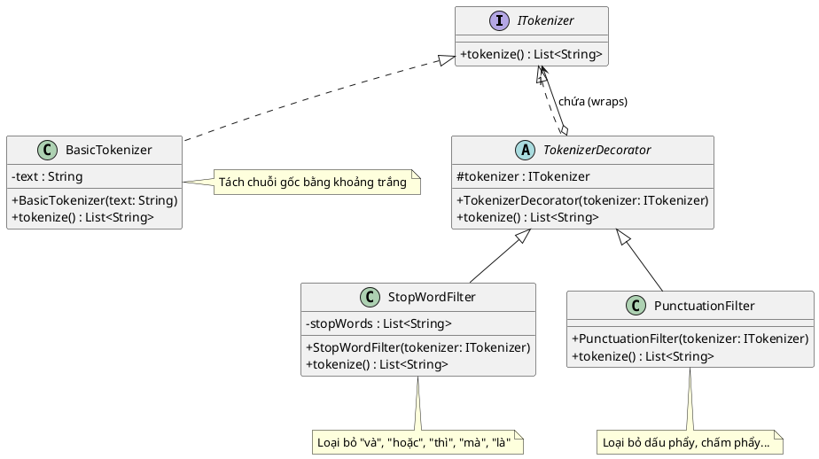

Một bài toán xử lý chuỗi rất thực tế! 📝 Áp dụng mẫu **Decorator** vào bài toán Tokenize (tách từ) này là một sự lựa chọn hoàn hảo.

Thay vì tạo ra các lớp phức tạp như `TokenizeBoDauCau`, `TokenizeBoStopWord`, hay `TokenizeBoDauCauVaStopWord`, chúng ta sẽ thiết kế một bộ tách từ cơ bản (Component), sau đó "bọc" nó bằng các bộ lọc (Decorators) để tùy ý thêm chức năng loại bỏ dấu câu hoặc loại bỏ từ dừng.

Dưới đây là thiết kế chi tiết bằng mã nguồn Java và biểu đồ PlantUML cho bài toán của bạn.

### 1. Mã nguồn Java

Chúng ta sẽ tạo một giao diện `ITokenizer` trả về một danh sách các từ (`List<String>`).

```java
import java.util.ArrayList;
import java.util.Arrays;
import java.util.List;

// 1. Lớp giao diện gốc (Component)
interface ITokenizer {
    List<String> tokenize();
}

// 2. Lớp tách từ cơ bản (Concrete Component)
class BasicTokenizer implements ITokenizer {
    private String text;

    public BasicTokenizer(String text) {
        this.text = text;
    }

    @Override
    public List<String> tokenize() {
        // Tách chuỗi thành các từ dựa trên khoảng trắng
        // Sử dụng ArrayList để có thể dễ dàng xóa phần tử ở các bước sau
        return new ArrayList<>(Arrays.asList(text.split("\\s+")));
    }
}

// 3. Lớp Decorator cơ sở (Base Decorator)
abstract class TokenizerDecorator implements ITokenizer {
    protected ITokenizer tokenizer; // Đối tượng bị bọc bên trong

    public TokenizerDecorator(ITokenizer tokenizer) {
        this.tokenizer = tokenizer;
    }

    @Override
    public List<String> tokenize() {
        return tokenizer.tokenize();
    }
}

// 4. Decorator cụ thể: Loại bỏ Stop words (Concrete Decorator)
class StopWordFilter extends TokenizerDecorator {
    // Danh sách các từ dừng theo yêu cầu đề bài
    private List<String> stopWords = Arrays.asList("và", "hoặc", "thì", "mà", "là");

    public StopWordFilter(ITokenizer tokenizer) {
        super(tokenizer);
    }

    @Override
    public List<String> tokenize() {
        // Lấy danh sách từ từ lớp bị bọc
        List<String> tokens = super.tokenize();
        
        // Xóa các từ nằm trong danh sách stopWords (không phân biệt hoa thường)
        tokens.removeIf(token -> stopWords.contains(token.toLowerCase()));
        
        return tokens;
    }
}

// 5. Decorator cụ thể: Loại bỏ dấu câu (Concrete Decorator)
class PunctuationFilter extends TokenizerDecorator {
    public PunctuationFilter(ITokenizer tokenizer) {
        super(tokenizer);
    }

    @Override
    public List<String> tokenize() {
        List<String> tokens = super.tokenize();
        
        for (int i = 0; i < tokens.size(); i++) {
            // Loại bỏ các ký tự không phải là chữ cái hoặc số (loại bỏ dấu câu)
            // Ví dụ: "phẩy)," -> "phẩy"
            String cleanedToken = tokens.get(i).replaceAll("[^a-zA-Z0-9A-ZÀ-ỹ]", "");
            tokens.set(i, cleanedToken);
        }
        
        // Xóa các phần tử rỗng (trường hợp token chỉ chứa mỗi dấu câu)
        tokens.removeIf(String::isEmpty);
        
        return tokens;
    }
}

// --- CHƯƠNG TRÌNH CHÍNH TẠO ỨNG DỤNG ---
public class Main {
    public static void main(String[] args) {
        String input = "Xin chào, tên tôi là Nam; tôi thích học toán và lập trình.";
        System.out.println("Chuỗi gốc: " + input + "\n");

        // Lựa chọn 1: Chỉ tách từ cơ bản
        ITokenizer basic = new BasicTokenizer(input);
        System.out.println("1. Tách từ cơ bản: \n" + basic.tokenize());

        // Lựa chọn 2: Tách từ + Loại bỏ dấu câu
        ITokenizer noPunctuation = new PunctuationFilter(new BasicTokenizer(input));
        System.out.println("2. Bỏ dấu câu: \n" + noPunctuation.tokenize());

        // Lựa chọn 3: Tách từ + Loại bỏ dấu câu + Loại bỏ từ dừng (Pipeline hoàn chỉnh)
        ITokenizer fullPipeline = new StopWordFilter(
                                      new PunctuationFilter(
                                          new BasicTokenizer(input)
                                      )
                                  );
        System.out.println("3. Bỏ dấu câu và Stop words: \n" + fullPipeline.tokenize());
    }
}

```

### 2. Code biểu đồ PlantUML

Bạn có thể copy đoạn mã dưới đây dán vào các trình vẽ PlantUML (như PlantText hoặc plugin trên IDE) để tạo ra biểu đồ UML minh họa cấu trúc lớp.



Bạn có thể thấy thiết kế này rất giống với cách các thư viện xử lý ngôn ngữ tự nhiên (NLP) thực tế xây dựng các "Data Pipeline" (luồng xử lý dữ liệu) của họ. Dữ liệu sẽ chảy qua từng bộ lọc một cách linh hoạt.

Bạn có muốn tôi thử ra một bài tập nhỏ để kết hợp mẫu Decorator này với một mẫu khác (ví dụ: dùng Factory để tạo ra các bộ lọc này dựa trên cấu hình do người dùng chọn) không? Hay bạn muốn tiếp tục ôn tập với một bài toán khác về mẫu Facade hoặc Composite?