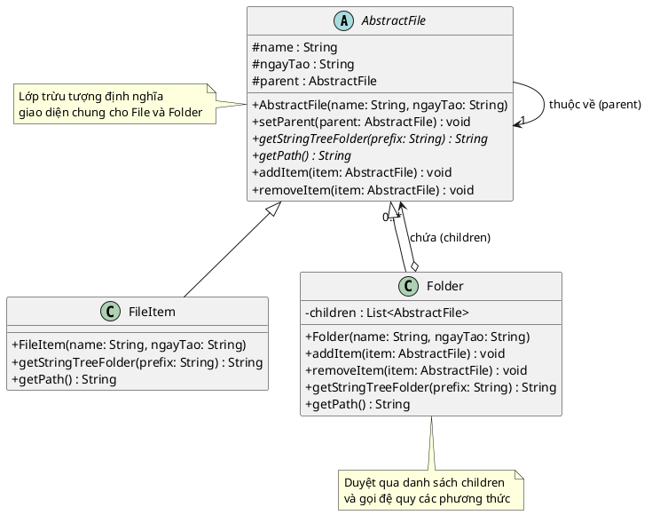

Một bài toán cực kỳ kinh điển và thực tế để minh họa cho mẫu **Composite (Cấu trúc cây)** 🌳!

Trong bài toán quản lý hệ thống tập tin này, chúng ta sẽ xem cả **File (Tập tin)** và **Folder (Thư mục)** như là những "Thành phần" (Component) giống nhau. Nhờ vậy, khi gọi lệnh in cây thư mục hay lấy đường dẫn, hệ thống sẽ tự động lan truyền lệnh đó từ thư mục gốc xuống các thư mục con và các file bên trong mà không cần quan tâm nó đang xử lý đối tượng nào.

Dưới đây là mã nguồn Java và biểu đồ PlantUML (PUML) chi tiết theo đúng cấu trúc yêu cầu trong đề bài của bạn.

### 1. Mã nguồn Java

Chúng ta sẽ tạo một lớp trừu tượng `AbstractFile` đóng vai trò là Component, sau đó lớp `FileItem` (Lá) và `Folder` (Cành) sẽ kế thừa lớp này.

Để phương thức `getPath()` (lấy đường dẫn) hoạt động chính xác từ dưới lên trên, tôi sẽ thêm một thuộc tính `parent` (thư mục cha) vào lớp gốc để mỗi đối tượng tự biết nó đang nằm ở đâu.

```java
import java.util.ArrayList;
import java.util.List;

// 1. Lớp Component (Thành phần chung cho cả File và Folder)
abstract class AbstractFile {
    protected String name;
    protected String ngayTao;
    protected AbstractFile parent; // Lưu tham chiếu đến thư mục cha để tính đường dẫn

    public AbstractFile(String name, String ngayTao) {
        this.name = name;
        this.ngayTao = ngayTao;
    }

    public void setParent(AbstractFile parent) {
        this.parent = parent;
    }

    // Các phương thức trừu tượng buộc các lớp con phải triển khai
    public abstract String getStringTreeFolder(String prefix);
    public abstract String getPath();

    // Các phương thức thêm/xóa mặc định ném lỗi (vì File không thể chứa phần tử)
    public void addItem(AbstractFile item) {
        throw new UnsupportedOperationException("Không hỗ trợ thêm vào File.");
    }

    public void removeItem(AbstractFile item) {
        throw new UnsupportedOperationException("Không hỗ trợ xóa từ File.");
    }
}

// 2. Lớp Leaf (Tập tin đơn lẻ)
class FileItem extends AbstractFile {
    public FileItem(String name, String ngayTao) {
        super(name, ngayTao);
    }

    @Override
    public String getStringTreeFolder(String prefix) {
        return prefix + name + "\n"; // File chỉ trả về tên của nó kèm theo khoảng trắng thụt lề
    }

    @Override
    public String getPath() {
        if (parent != null) {
            return parent.getPath() + "\\" + name;
        }
        return name;
    }
}

// 3. Lớp Composite (Thư mục - Có thể chứa File hoặc Thư mục con)
class Folder extends AbstractFile {
    private List<AbstractFile> children = new ArrayList<>();

    public Folder(String name, String ngayTao) {
        super(name, ngayTao);
    }

    @Override
    public void addItem(AbstractFile item) {
        children.add(item);
        item.setParent(this); // Thiết lập thư mục cha cho phần tử con
    }

    @Override
    public void removeItem(AbstractFile item) {
        children.remove(item);
        item.setParent(null);
    }

    @Override
    public String getStringTreeFolder(String prefix) {
        StringBuilder sb = new StringBuilder();
        // In tên thư mục hiện tại
        sb.append(prefix).append(name).append("\n");
        
        // Gọi đệ quy để in các thành phần con bên trong với độ thụt lề tăng lên
        for (AbstractFile child : children) {
            sb.append(child.getStringTreeFolder(prefix + "    "));
        }
        return sb.toString();
    }

    @Override
    public String getPath() {
        if (parent != null) {
            return parent.getPath() + "\\" + name;
        }
        return name;
    }
}

// 4. Chương trình chính theo đúng dữ liệu đề bài
public class Main {
    public static void main(String[] args) {
        String today = "05/03/2026"; // Ngày tạo giả định

        // 1. Khởi tạo các Folder
        Folder root = new Folder("Data (D:)", today);
        Folder taiLieu = new Folder("TaiLieu", today);
        
        Folder designPattern = new Folder("Design Pattern", today);
        Folder lapTrinhJava = new Folder("Lap Trinh Java", today);
        Folder lapTrinhDiDong = new Folder("LapTrinhThietBiDiDong", today);

        // 2. Thêm file vào thư mục Design Pattern
        designPattern.addItem(new FileItem("CreationalPattern.pptx", today));
        designPattern.addItem(new FileItem("StructuralPattern.pptx", today));

        // 3. Thêm file vào thư mục Lap Trinh Java
        lapTrinhJava.addItem(new FileItem("LapTrinhJavaCoBan.docx", today));
        lapTrinhJava.addItem(new FileItem("LapTrinhJavaNangCao.pdf", today));

        // 4. Khởi tạo file C đơn lẻ
        FileItem ngonNguC = new FileItem("NgonNguLapTrinhC.pdf", today);

        // 5. Thêm file vào thư mục LapTrinhThietBiDiDong
        lapTrinhDiDong.addItem(new FileItem("CoBan.pptx", today));
        lapTrinhDiDong.addItem(new FileItem("NangCao.pptx", today));

        // 6. Xây dựng cấu trúc cây
        taiLieu.addItem(designPattern);
        taiLieu.addItem(lapTrinhJava);
        taiLieu.addItem(ngonNguC);
        taiLieu.addItem(lapTrinhDiDong);
        
        root.addItem(taiLieu);

        // 7. IN KẾT QUẢ
        System.out.println("--- 1. CÂY THƯ MỤC ---");
        System.out.println(root.getStringTreeFolder("")); // Truyền khoảng trắng rỗng làm thụt lề ban đầu

        System.out.println("--- 2. KIỂM TRA ĐƯỜNG DẪN (getPath) ---");
        System.out.println("Đường dẫn thư mục Design Pattern: " + designPattern.getPath());
        System.out.println("Đường dẫn file NgonNguLapTrinhC:  " + ngonNguC.getPath());
    }
}

```

---

### 2. Code biểu đồ PlantUML

Dưới đây là mã PlantUML thể hiện trực quan cấu trúc trên. Bạn có thể sử dụng các công cụ vẽ UML online hoặc plugin trong IDE để hiển thị nó. Mũi tên có hình thoi rỗng (`o--`) thể hiện mối quan hệ *Aggregation* (Kết hợp), vì một Folder sẽ chứa một danh sách các AbstractFile bên trong nó.



Bạn có thể thấy rõ sự thanh lịch của Composite trong đoạn code ở hàm `main`: Hệ thống gọi `root.getStringTreeFolder("")`, và thư mục gốc tự động "nhờ vả" các thư mục con và các tập tin bên dưới nó hoàn thành phần việc còn lại theo đúng cấu trúc hình cây.

Chúng ta đã có những ví dụ rất thực tiễn cho nhóm Cấu trúc (Structural). Bạn muốn tiếp tục hành trình mổ xẻ các Design Patterns với nhóm **Creational (Khởi tạo)** hay nhóm **Behavioral (Hành vi)**?