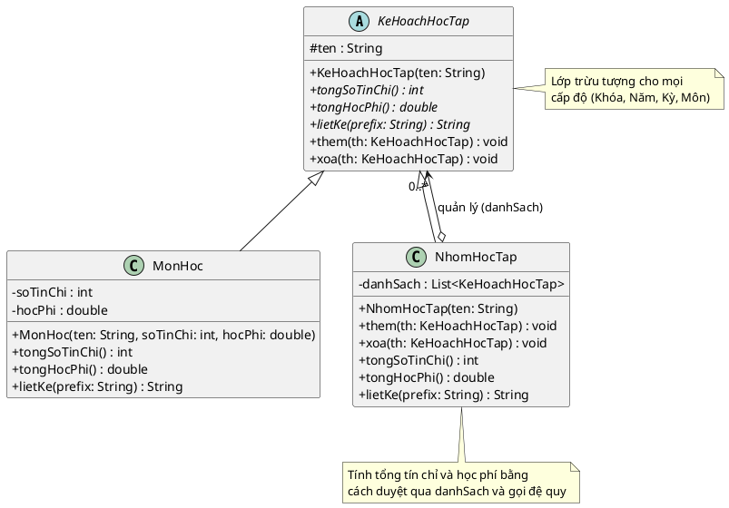

Bài toán **B4. Composite Pattern** là một ví dụ tuyệt vời khác để áp dụng cấu trúc cây 🌳!

Trong hệ thống giáo dục này, chúng ta có một cấu trúc phân cấp rất rõ ràng:
**Khóa học** (chứa nhiều) ➡️ **Năm học** (chứa nhiều) ➡️ **Kỳ học** (chứa nhiều) ➡️ **Môn học**.

Nếu áp dụng mẫu Composite, chúng ta có thể xem *Môn học* là các "Lá" (Leaf), và các cấp bậc quản lý như *Kỳ học, Năm học, Khóa học* đều là các "Cành" (Composite). Tất cả chúng đều tuân theo một giao diện chung để lấy tổng số tín chỉ, tính tổng học phí và liệt kê danh sách.

Dưới đây là mã nguồn Java và biểu đồ PlantUML hoàn chỉnh cho bài toán này.

### 1. Mã nguồn Java

Chúng ta sẽ tạo một lớp trừu tượng `KeHoachHocTap` làm Component gốc. Lớp `MonHoc` sẽ đóng vai trò là Leaf, và lớp `NhomHocTap` (dùng chung cho Khóa, Năm, Kỳ) sẽ đóng vai trò là Composite.

```java
import java.util.ArrayList;
import java.util.List;

// 1. Lớp Component (Thành phần chung)
abstract class KeHoachHocTap {
    protected String ten;

    public KeHoachHocTap(String ten) {
        this.ten = ten;
    }

    // Các phương thức trừu tượng
    public abstract int tongSoTinChi();
    public abstract double tongHocPhi();
    public abstract String lietKe(String prefix);

    // Phương thức quản lý danh sách (mặc định ném lỗi đối với Leaf)
    public void them(KeHoachHocTap th) {
        throw new UnsupportedOperationException("Không thể thêm vào thành phần này.");
    }

    public void xoa(KeHoachHocTap th) {
        throw new UnsupportedOperationException("Không thể xóa khỏi thành phần này.");
    }
}

// 2. Lớp Leaf (Môn học cụ thể - không chứa phần tử con)
class MonHoc extends KeHoachHocTap {
    private int soTinChi;
    private double hocPhi;

    public MonHoc(String ten, int soTinChi, double hocPhi) {
        super(ten);
        this.soTinChi = soTinChi;
        this.hocPhi = hocPhi;
    }

    @Override
    public int tongSoTinChi() {
        return soTinChi;
    }

    @Override
    public double tongHocPhi() {
        return hocPhi;
    }

    @Override
    public String lietKe(String prefix) {
        return prefix + "- Môn học: " + ten + " | Tín chỉ: " + soTinChi + " | Học phí: " + String.format("%,.0f", hocPhi) + " VNĐ\n";
    }
}

// 3. Lớp Composite (Nhóm học tập: Đại diện cho Khóa học, Năm học, hoặc Kỳ học)
class NhomHocTap extends KeHoachHocTap {
    private List<KeHoachHocTap> danhSach = new ArrayList<>();

    public NhomHocTap(String ten) {
        super(ten);
    }

    @Override
    public void them(KeHoachHocTap th) {
        danhSach.add(th);
    }

    @Override
    public void xoa(KeHoachHocTap th) {
        danhSach.remove(th);
    }

    @Override
    public int tongSoTinChi() {
        int tong = 0;
        for (KeHoachHocTap th : danhSach) {
            tong += th.tongSoTinChi(); // Đệ quy tính tổng tín chỉ
        }
        return tong;
    }

    @Override
    public double tongHocPhi() {
        double tong = 0;
        for (KeHoachHocTap th : danhSach) {
            tong += th.tongHocPhi(); // Đệ quy tính tổng học phí
        }
        return tong;
    }

    @Override
    public String lietKe(String prefix) {
        StringBuilder sb = new StringBuilder();
        // In ra tên nhóm (Khóa/Năm/Kỳ) cùng với tổng kết của nhóm đó
        sb.append(prefix).append("+ ").append(ten)
          .append(" [Tổng TC: ").append(tongSoTinChi())
          .append(" | Tổng HP: ").append(String.format("%,.0f", tongHocPhi())).append(" VNĐ]\n");
        
        // Duyệt qua các thành phần con
        for (KeHoachHocTap th : danhSach) {
            sb.append(th.lietKe(prefix + "    ")); // Thêm khoảng trắng thụt lề
        }
        return sb.toString();
    }
}

// 4. CHƯƠNG TRÌNH CHÍNH
public class Main {
    public static void main(String[] args) {
        // --- TẠO MÔN HỌC ---
        MonHoc m1 = new MonHoc("Lập trình C", 3, 1500000);
        MonHoc m2 = new MonHoc("Toán rời rạc", 3, 1500000);
        MonHoc m3 = new MonHoc("Cấu trúc dữ liệu", 4, 2000000);
        MonHoc m4 = new MonHoc("Lập trình Java", 4, 2000000);
        MonHoc m5 = new MonHoc("Mạng máy tính", 3, 1500000);

        // --- TẠO KỲ HỌC ---
        NhomHocTap ky1 = new NhomHocTap("Kỳ 1");
        ky1.them(m1);
        ky1.them(m2);

        NhomHocTap ky2 = new NhomHocTap("Kỳ 2");
        ky2.them(m3);
        ky2.them(m4);

        NhomHocTap ky3 = new NhomHocTap("Kỳ 3");
        ky3.them(m5);

        // --- TẠO NĂM HỌC ---
        NhomHocTap nam1 = new NhomHocTap("Năm học 1");
        nam1.them(ky1);
        nam1.them(ky2);

        NhomHocTap nam2 = new NhomHocTap("Năm học 2");
        nam2.them(ky3);

        // --- TẠO KHÓA HỌC ---
        NhomHocTap khoaHoc = new NhomHocTap("Khóa học Kỹ Thuật Phần Mềm 2024-2028");
        khoaHoc.them(nam1);
        khoaHoc.them(nam2);

        // --- IN KẾT QUẢ ---
        // Bạn có thể lấy thông tin của TOÀN BỘ khóa học
        System.out.println("=== THÔNG TIN TOÀN BỘ KHÓA HỌC ===");
        System.out.println(khoaHoc.lietKe(""));

        System.out.println("----------------------------------");
        
        // Hoặc chỉ lấy thông tin của MỘT NĂM CỤ THỂ một cách đồng nhất
        System.out.println("=== THÔNG TIN RIÊNG NĂM 1 ===");
        System.out.println(nam1.lietKe(""));
    }
}

```

---

### 2. Code biểu đồ PlantUML

Bạn có thể sử dụng đoạn mã dưới đây để sinh ra biểu đồ UML minh họa cấu trúc lớp:



**Phân tích điểm sáng:** Trong giải pháp này, lớp `NhomHocTap` rất đa năng. Nó có thể đóng vai trò là "Kỳ học", "Năm học" hay "Khóa học" đều được. Bạn không cần phải tạo ra 3 lớp riêng biệt (`LopKyHoc`, `LopNamHoc`, `LopKhoaHoc`) vì hành vi của chúng hoàn toàn giống nhau: Chứa các thành phần con và cộng dồn kết quả từ dưới lên.

Đây là một điểm chốt hoàn hảo cho nhóm **Structural patterns**. Kế tiếp, bạn có muốn khám phá nhóm **Behavioral (Hành vi)** (như mẫu Observer - Quan sát viên) hay nhảy sang nhóm **Creational (Khởi tạo)** (như mẫu Singleton, Factory) không?