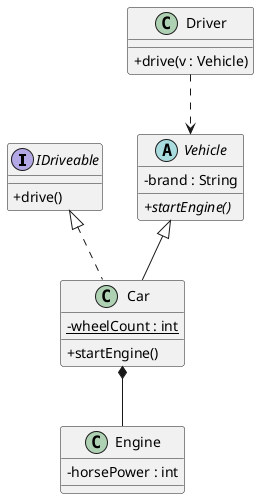

Chào bạn, đây là bảng tổng hợp các ký hiệu **PlantUML (PUML)** thường dùng nhất khi vẽ sơ đồ lớp (Class Diagram). Bạn có thể gửi bảng "Cheat Sheet" này cho sinh viên để các em tiện tra cứu khi làm bài tập.

### 1. Ký hiệu về Thuộc tính & Phương thức (Visibility)

Quy định quyền truy cập của biến và hàm.

| Ký hiệu | Ý nghĩa | Từ khóa Java tương ứng |
| --- | --- | --- |
| **`-`** | **Private** | `private` (Chỉ nội bộ lớp dùng) |
| **`+`** | **Public** | `public` (Ai cũng dùng được) |
| **`#`** | **Protected** | `protected` (Lớp con và trong gói dùng được) |
| **`~`** | **Package** | (mặc định/không viết gì) |

**Ví dụ:**

```plantuml
class Student {
    - name : String
    + getName() : String
    # age : int
}

```

---

### 2. Các Mối Quan Hệ (Relationships) - Quan trọng! 🔥

Đây là phần sinh viên hay nhầm lẫn nhất. Hãy nhớ quy tắc hình dáng mũi tên.

| Hình ảnh (PUML) | Tên quan hệ | Ý nghĩa & Ví dụ |
| --- | --- | --- |
| **`< | --`** | **Kế thừa** (Inheritance) |
| **`< | ..`** | **Hiện thực hóa** (Realization) |
| **`*--`** | **Hợp thành** (Composition) | **"Là phần tử sống chết có nhau" (Part-of)**.<br>

<br>Mối quan hệ mạnh nhất. Nếu Hóa đơn hủy thì Chi tiết hóa đơn cũng mất theo.<br>

<br>VD: `HoaDon` *-- `CTHD` |
| **`o--`** | **Tụ hợp** (Aggregation) | **"Sở hữu nhưng độc lập" (Has-a)**.<br>

<br>Mối quan hệ lỏng lẻo hơn. Phòng học chứa Học sinh, nhưng Phòng học hủy thì Học sinh vẫn còn.<br>

<br>VD: `ClassRoom` o-- `Student` |
| **`-->`** | **Kết hợp** (Association) | **"Có liên hệ/Biết tới"**.<br>

<br>Đối tượng A giữ tham chiếu lâu dài tới B (thường là biến instance).<br>

<br>VD: `GiaoVien` --> `MonHoc` (Giáo viên phụ trách môn học) |
| **`..>`** | **Phụ thuộc** (Dependency) | **"Sử dụng tạm thời" (Uses-a)**.<br>

<br>A chỉ dùng B trong 1 hàm rồi thôi, không giữ lại.<br>

<br>VD: `User` ..> `MayIn` (Người dùng gọi hàm in) |

**Mẹo nhớ cho sinh viên:**

* **Đường liền:** Quan hệ chắc chắn, lâu dài (Kế thừa, Composition, Association).
* **Đường đứt nét:** Quan hệ lỏng lẻo, trừu tượng (Interface, Dependency).
* **Hình thoi ĐEN (`*`):** Chết chùm (Composition).
* **Hình thoi TRẮNG (`o`):** Độc lập (Aggregation).

---

### 3. Các ký hiệu đặc biệt khác

| Ký hiệu | Cú pháp PUML | Giải thích |
| --- | --- | --- |
| **Static** | `{static}` hoặc gạch chân | Biến/hàm tĩnh, dùng chung cho cả lớp. |
| **Abstract** | `{abstract}` hoặc in nghiêng | Lớp trừu tượng hoặc phương thức trừu tượng. |
| **Interface** | `interface TenLop` hoặc `<<Interface>>` | Định nghĩa một Interface. |
| **Ghi chú** | `note right of ... end note` | Tạo khung ghi chú màu vàng để giải thích code. |
| **Ngăn cách** | `..` hoặc `==` | Đường kẻ ngang dùng để phân chia các nhóm thuộc tính trong 1 class cho dễ nhìn. |

### 4. Code mẫu tổng hợp (Copy để demo)



Hy vọng bảng tóm tắt này giúp sinh viên của bạn dễ dàng nắm bắt cú pháp PlantUML hơn!